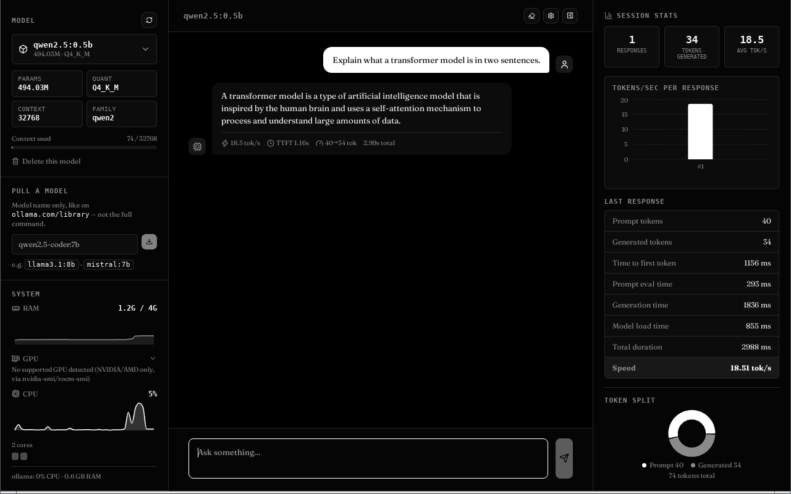
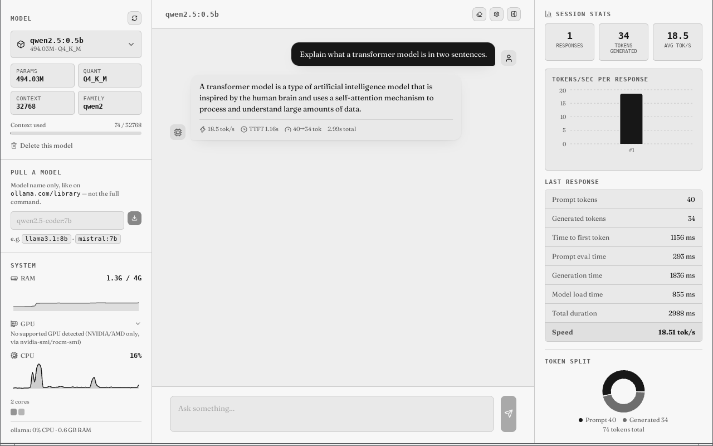
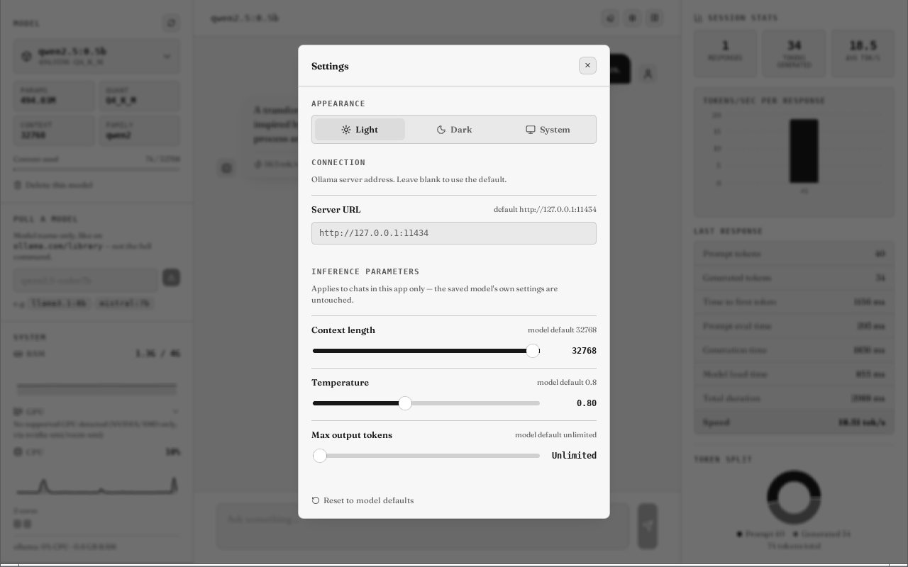

# Spine

A native desktop chat client for local LLMs, built on top of [Ollama](https://ollama.com). Built with Tauri + React.

Spine gives you a proper interface for models you're already running locally — model switching, live performance stats, a system resource monitor, and a settings panel for tuning inference on the fly, all without leaving your machine.

## Screenshots

<p align="center">
  
  
</p>
<p align="center">
  
</p>

## Features

- **Model switcher** — swap between installed models, and pull new ones straight from the UI
- **Live performance stats** — tokens/sec, time-to-first-token, prompt/generation timing breakdown, per-session summaries
- **System monitor** — GPU utilization/VRAM/temp (NVIDIA/AMD), CPU, RAM, per-core usage, and the Ollama process's own resource footprint, live
- **Settings** — light/dark/system theme, a configurable Ollama server URL, and sliders for context length, temperature, and max output tokens
- **Markdown + syntax highlighting** in responses

## Requirements

- [Ollama](https://ollama.com) installed and running (`ollama serve`)
- A Debian-based Linux distribution (developed and tested on Debian Trixie)

Spine talks to Ollama's local API at `http://127.0.0.1:11434` by default — that's what `ollama serve` uses out of the box, so there's nothing extra to configure. If Ollama is running elsewhere (a different port, or another machine on your network), set the server URL in Settings.

## Install

No pre-built release yet — build from source.

Prerequisites: Node.js + npm, Rust (via [rustup](https://rustup.rs)), and Tauri's Linux build deps:

```bash
sudo apt install libwebkit2gtk-4.1-dev libgtk-3-dev librsvg2-dev libayatana-appindicator3-dev patchelf
```

Build:

```bash
git clone https://github.com/fusionfall33exe-cell/spine.git
cd spine
npm install
npm run tauri build
```

This lands two installable packages in `src-tauri/target/release/bundle/`:

- `.deb`: `sudo apt install ./src-tauri/target/release/bundle/deb/Spine_*.deb`
- `.AppImage`: run `src-tauri/target/release/bundle/appimage/Spine_*.AppImage` directly, no install needed

## Development

```bash
npm run tauri dev
```

## Notes

- Everything runs locally through your own Ollama instance. Spine doesn't send anything anywhere else.
- Settings overrides (context length, temperature, max output tokens) apply only within the app for the current session — they never modify your saved Ollama models.

## License

MIT — see [LICENSE](LICENSE).
